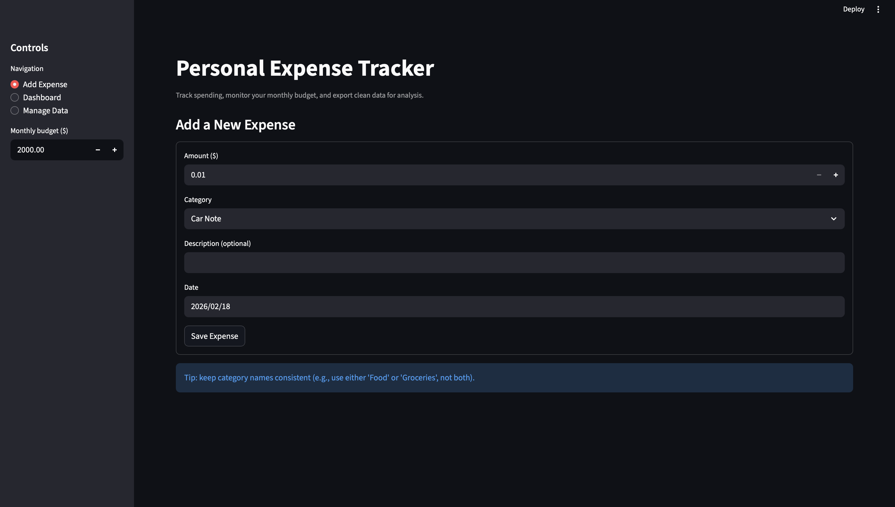
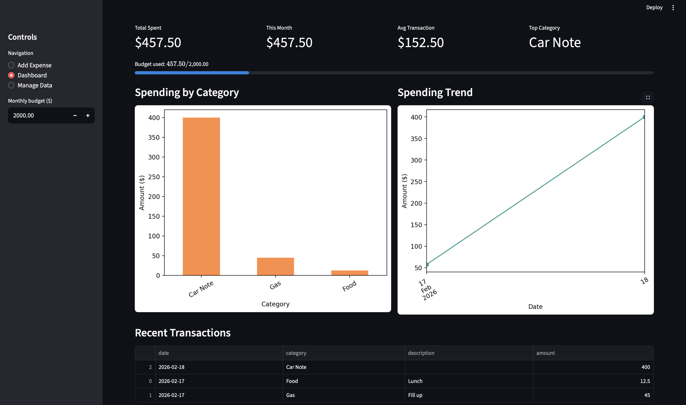

# Expense Tracker Dashboard

A data-driven personal expense tracker built with Python, Streamlit, and pandas. The application allows users to record expenses, filter spending data, visualize trends, and manage stored entries through an interactive dashboard.

## Live Demo

Access the deployed app here:
https://expense-tracker-dashboard-zf2vjfqzwddq5zyezznvc3.streamlit.app/

## Features

- Add and store expenses with category, description, and date
- Category dropdown with option to add new categories
- Interactive dashboard with spending analytics
- Filter expenses by category and date range
- Visualize spending using bar and line charts
- View and manage saved expenses
- Delete expense entries
- Persistent storage using JSON

## Screenshots

### Add Expense Page



### Dashboard Overview



## Tech Stack

- Python
- Streamlit
- Pandas
- Matplotlib
- JSON storage

## How to Run

```bash
git clone https://github.com/miles-price/expense-tracker-dashboard.git
cd expense-tracker-dashboard
pip install -r requirements.txt
python3 -m streamlit run app.py

